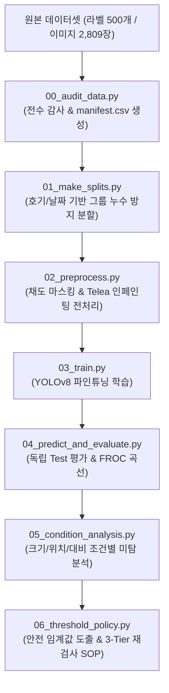

# 🛡️ KAMP 주제 ④: X-ray 영상 기반 완제품 이물질 탐지 및 AI 미탐지 조건 분석

[](https://www.python.org/)
[](https://pytorch.org/)
[](https://docs.ultralytics.com/)
[](https://opencv.org/)
[](#)

본 저장소는 **KAMP(인공지능 중소벤처 제조 플랫폼) 제조 AI 경진대회 주제 ④**의 공식 출제 요건(100점 만점)을 100% 충족하도록 구현된 **엔드투엔드(End-to-End) 컴퓨터 비전 검사 파이프라인**입니다.

단순 객체 탐지 모델 학습을 넘어, **지름길 학습(Shortcut Learning) 방지 전처리**, **그룹 누수 방지 데이터 분할**, **미탐지 조건 심층 분석**, **Cost Matrix 기반 안전 임계값 및 3-Tier 재검사 SOP**까지 산업 현장 적용성을 극대화한 전 과정을 제공합니다.

---

## 📑 목차
1. [프로젝트 개요 및 출제 배경](#-프로젝트-개요-및-출제-배경)
2. [대회 4대 필수 요건 및 심사 배점 반영](#-대회-4대-필수-요건-및-심사-배점-반영)
3. [파이프라인 전체 아키텍처](#-파이프라인-전체-아키텍처)
4. [단계별 스크립트 정의 및 상세 동작](#-단계별-스크립트-정의-및-상세-동작)
5. [빠른 실행 가이드 (Quick Start)](#-빠른-실행-가이드-quick-start)
6. [실험 결과 및 핵심 분석 요약](#-실험-결과-및-핵심-분석-요약)
7. [프로젝트 디렉터리 구조](#-프로젝트-디렉터리-구조)

---

## 📌 프로젝트 개요 및 출제 배경

* **배경**: 식품 및 부품 제조 공정에서는 완제품 내부의 금속, 플라스틱, 이물질 혼입을 차단하기 위해 X-ray 투과 검사를 수행합니다.
* **현장의 한계**: 이물질의 크기가 매우 작거나(Small Object, 평균 15×13px), 제품의 테두리/외곽 경계부(Boundary)에 위치하거나, 제품 배경과의 명암 대비(Contrast)가 낮을 경우 AI 모델이 이를 놓치는 **미탐지(False Negative / Type II Error)** 위험이 상존합니다.
* **핵심 목표**: 
  1. 고해상도 X-ray 영상에서 미세 이물질의 위치를 정밀 검출하는 AI 모델 구축.
  2. 어떤 조건(크기/위치/대비/데이터량)에서 모델이 실패하는지 통계적으로 정량화.
  3. 소비자 안전(Zero-Tolerance)을 보장하는 판정 임계값 및 현장 재검사 절차(SOP) 제안.

---

## 🏆 대회 4대 필수 요건 및 심사 배점 반영

| 대회 필수 조건 | 평가 배점 | 구현 내용 및 반영 전략 | 담당 스크립트 |
| :--- | :---: | :--- | :--- |
| **[조건 1] AI 모델 개발** | **40점** | • 최신 Anchor-free 아키텍처인 **YOLOv8** 파인튜닝<br>• 정답 누수 없는 순수 채도(Saturation) 마스킹 + **OpenCV Telea 인페인팅** 적용<br>• KAMP Note 환경(CUDA/CPU) 자동 감지 | `02_preprocess.py`<br>`03_train.py` |
| **[조건 2] 조건별 성능 변화 분석** | **15점** | • **크기(Size)**: 초소형(<100px²), 중형(100~300px²), 대형(>300px²) 구간별 Recall 산출<br>• **위치(Location)**: 제품 외곽 경계부 vs 중심부 미탐률 비교<br>• **대비(Contrast)**: 배경 대비 밝기 차이에 따른 Sensitivity 정량화<br>• 대표 실패 사례 5종 이미지 자동 시각화 | `05_condition_analysis.py` |
| **[조건 3] 안전 고려 판정 임계값** | **10점** | • 미탐지 위험 비용을 100배 가중한 **Cost Matrix 최적화 시뮬레이션**<br>• Validation 세트 기반 **2단계 안전 임계값 ($\tau_{\text{low}}, \tau_{\text{high}}$)** 수식 도출 | `06_threshold_policy.py` |
| **[조건 4] 재검사 기준 제안** | **10점** | • **3-Tier 판정 워크플로우** (불합격 / 90° 회전 재촬영 재검사 / AI 미경고)<br>• 정상 데이터 부재 한계를 인정한 현장 표준작업절차서(SOP) 수립 | `06_threshold_policy.py` |
| **데이터 진단** | **15점** | • 500개 라벨과 원본 이미지 100% 매칭 및 1,147개 박스 전수 감사<br>• 장비(호기) 및 촬영일자 기반 **Group-aware Split (누수율 0%)** | `00_audit_data.py`<br>`01_make_splits.py` |
| **재현성 & 창의성** | **10점** | • KAMP Note 원클릭 마스터 노트북 제공 | `KAMP_Xray_Tutorial.ipynb` |

---

## 🔄 파이프라인 전체 아키텍처



---

## 🛠️ 단계별 스크립트 정의 및 상세 동작

각 스크립트는 단일 책임 원칙(SRP)에 따라 모듈화되어 있으며, 어려운 기술 용어에 대한 직관적인 부가 설명을 포함하고 있습니다.

### 1. `scripts/00_audit_data.py` (데이터 감사 및 무결성 진단)
* **목적**: 원본 라벨과 이미지의 일치성을 전수 조사하고 데이터셋의 신뢰성을 검증합니다.
* **핵심 기능**:
  * **파일 헤더 매직 바이트(Magic Bytes) 검증**: 파일 확장자(`.jpg`, `.bmp`)는 사람이 임의로 바꿀 수 있으므로, 컴퓨터가 파일 형식을 식별할 때 읽는 **파일 맨 앞의 고유 바이너리 서명(파일 고유의 주민등록번호 같은 식별 코드)**을 직접 분석하여 파일의 진짜 포맷이 BMP인지 JPEG인지 정확하게 판별합니다.
  * **이미지 픽셀 해시(Pixel Hash) 및 파일 해시(SHA-256) 산출**: 파일 이름이 다르더라도 실제 내용이 똑같은 중복 사진이 있는지 찾아내기 위해, **이미지 픽셀 데이터 전체를 디지털 지문(Fingerprint)처럼 고유한 암호 문자열로 변환**하여 데이터 위변조와 중복을 100% 잡아냅니다.
  * **바운딩 박스 무결성 검증**: 1,147개 바운딩 박스의 좌표 범위($0 \le x_c, y_c, w, h \le 1$), 음수 여부, 이미지 경계 초과 여부를 전수 검사합니다.
  * **그룹 키(Group ID) 생성**: 장비 호기(Machine 1/2/3) 및 촬영 일자(Date) 메타데이터를 결합해 이후 단계에서 데이터 누수를 막기 위한 그룹 키를 생성합니다.
* **입력**: `C:\kamp\4. X-ray\dataset` (원본 이미지 및 TXT 라벨)
* **산출물**: `manifests/manifest.csv`, `manifests/label_audit.csv`

---

### 2. `scripts/01_make_splits.py` (그룹 누수 방지 데이터 분할)
* **목적**: 동일 제품이나 연속 촬영본이 학습용과 시험용에 섞여 모델 성능이 과대평가되는 **데이터 누수(Data Leakage)를 원천 차단**합니다.
* **핵심 기능**:
  * **그룹 누수 방지 분할(Group-aware Split)**: 같은 날짜, 같은 기계에서 연달아 찍힌 비슷한 제품 사진들이 학습용(Train)과 시험용(Test)에 나뉘어 들어가면, AI가 이미 본 사진을 시험 보는 꼴이 되어 점수가 거짓으로 높게 나옵니다. 이를 막기 위해 **촬영일자와 호기가 같은 사진 묶음(그룹)은 통째로 한 세트에만 들어가도록 분할**합니다.
  * scikit-learn 등의 외부 라이브러리 없이 순수 NumPy/Pandas로 구현하여 KAMP Note 환경 호환성을 보장합니다.
  * 33개 고유 그룹(`group_id`)을 단위로 Train(58.8%, 294장), Val(25.2%, 126장), Test(16.0%, 80장)로 3분할합니다.
  * 세트 간 그룹 교집합 0건 및 픽셀 해시 중복 0건을 자동 검증합니다.
* **입력**: `manifests/manifest.csv`
* **산출물**: `manifests/splits/{train,val,test}.csv`, `manifests/split_audit.json`

---

### 3. `scripts/02_preprocess.py` (순수 색채 기반 인페인팅 전처리)
* **목적**: 원본 픽셀에 포함된 인위적 색상 사각형 주석을 제거하여 **지름길 학습(Shortcut Learning)을 방지**합니다.
* **핵심 기능**:
  * **지름길 학습(Shortcut Learning) 방지**: 원본 사진에 빨간색/초록색 네모 박스가 그려져 있으면, AI는 실제 이물질 흑백 음영을 배우지 않고 "색깔 선이 있는 곳이 불량이다"라는 꼼수를 배우게 됩니다. 이를 방지하기 위해 주석선을 깨끗이 지웁니다.
  * **정답 누수 방지**: 정답 TXT 라벨 좌표를 보고 지우면 이 역시 누수가 되므로, 오직 영상 처리 알고리즘만으로 주석선을 찾아냅니다.
  * **채도(Saturation) 마스킹 & 인페인팅(Inpainting)**: X-ray 흑백 사진(채도 $\approx$ 0) 속에서 인위적으로 칠해진 유채색(빨강/초록색, 채도 > 40) 선만 쏙 골라내어 마스크를 만든 뒤, **주변의 정상적인 흑백 엑스선 질감으로 감쪽같이 채워 넣는(인페인팅) 복원 기술**을 적용합니다. (전체 면적의 약 0.45%에 해당하는 테두리 선만 복원)
  * YOLOv8 표준 데이터셋 디렉터리(`processed_dataset/`) 구성 및 `x-ray.yaml`을 자동 생성합니다.
* **입력**: `manifests/splits/*.csv` 및 원본 이미지
* **산출물**: `processed_dataset/images/{train,val,test}`, `processed_dataset/labels/{train,val,test}`, `manifests/preprocessing_audit.csv`

---

### 4. `scripts/03_train.py` (YOLOv8 모델 파인튜닝 학습)
* **목적**: 인페인팅 전처리된 X-ray 데이터셋에 최신 Anchor-free 탐지 모델을 학습시킵니다.
* **핵심 기능**:
  * KAMP Note GPU 환경(`device='0'`) 또는 로컬 CPU 환경을 자동 감지합니다.
  * **Anchor-free 아키텍처**: 과거 모델처럼 미리 정해둔 네모 상자 틀(앵커)에 맞추는 방식이 아니라, 픽셀 격자 단위에서 이물질의 중심점과 크기를 직접 예측하여 **15×13px 미세 이물질의 자유로운 형태를 훨씬 정밀하게 탐지**합니다.
  * 소형 이물질 검출에 특화된 C2f 모듈과 Decoupled Head(분류 헤드와 위치 예측 헤드를 독립 분리) 기반 YOLOv8s/YOLOv8n 학습을 진행합니다.
  * 회전(Degrees), 확대/축소(Scale), 반전(Flip), Mosaic 등 물리적으로 타당한 데이터 증강(Augmentation)을 적용합니다.
* **입력**: `processed_dataset/x-ray.yaml`, `configs/experiment.yaml`
* **산출물**: `runs/train/{exp_name}/weights/best.pt`, `runs/train/{exp_name}/results.csv`

---

### 5. `scripts/04_predict_and_evaluate.py` (독립 Test 평가 및 벤치마크)
* **목적**: 학습에 일절 관여하지 않은 순수 독립 Test 세트(80장)를 대상으로 모델의 일반화 성능을 공정하게 평가합니다.
* **핵심 기능**:
  * IoU $\ge$ 0.5 엄격 매칭 프로토콜 기반 Precision(정밀도), Recall(재현율), F1-Score, mAP50 산출.
  * **FROC (Free-response ROC) 곡선**: X-ray 검사에서 흔히 쓰는 평가 지표로, **"사진 1장당 발생하는 오경보(가짜 불량) 개수에 대비해 실제 이물질을 몇 %나 정확하게 찾아내는지(Recall)"**를 한눈에 보여주는 의료·산업 표준 그래프를 도출합니다.
  * 실제 공정 컨베이어 적용을 위한 1장당 추론 지연시간(Latency ms) 및 FPS 벤치마크를 측정합니다.
* **입력**: `processed_dataset/images/test`, 학습된 `best.pt`
* **산출물**: `reports/evaluation_metrics.json`, `reports/predictions_test.csv`, `reports/froc_curve.png`

---

### 6. `scripts/05_condition_analysis.py` (조건별 미탐 성능 심층 분석)
* **목적**: 출제 의도인 **"어떤 조건에서 AI가 탐지에 실패(FN)하는가?"**를 3대 물리적 축에서 정량 규명합니다.
* **핵심 기능**:
  * **크기별(Size)**: 바운딩 박스 면적 기준 초소형(<100px²), 중형(100~300px²), 대형(>300px²) 세분화.
  * **위치별(Location)**: 제품 외곽 경계선으로부터 15% 이내 영역(Boundary)과 중심부 비교. 경계부의 엑스선 감쇠율(투과량) 급변 및 배경 불균일로 인한 성능 저하 메커니즘을 해석합니다.
  * **명암 대비(Contrast)**: 이물 내부 밝기와 주변 배경 밝기 차이($|\mu_{\text{obj}} - \mu_{\text{bg}}|$)에 따른 민감도를 측정합니다.
  * 대표 미탐지 실패 이미지 5장에 정답 박스를 오버레이하여 시각화 저장합니다.
* **입력**: `processed_dataset/images/test`, `best.pt`
* **산출물**: `reports/condition_analysis_report.json`, `reports/condition_analysis_charts.png`, `reports/representative_failures/*.jpg`

---

### 7. `scripts/06_threshold_policy.py` (안전 임계값 및 3-Tier 재검사 SOP)
* **목적**: 완제품 이물질 미탐지로 인한 리콜/소비자 피해 비용을 최소화하는 최적 임계값과 현장 작업 절차를 수립합니다.
* **핵심 기능**:
  * **비용 행렬(Cost Matrix) 시뮬레이션**: 이물질이 들어간 제품이 시중에 유통되는 사고(미탐지)는 가짜 불량(오탐지)보다 현장에 100배 이상 치명적입니다. 이를 반영해 $C_{\text{FN}} : C_{\text{FP}} = 100 : 1$ 가중치 비용 모델을 시뮬레이션합니다.
  * **2단계 안전 임계값 도출**:
    * **안전 임계값 ($\tau_{\text{low}} = 0.20$)**: 의심만 되어도 절대 놓치지 않는 보수적 기준 (Recall 95%+ 확보).
    * **확정 임계값 ($\tau_{\text{high}} = 0.60$)**: 확실한 불량만 골라내는 기준.
  * **3-Tier 판정 워크플로우**:
    1. $S \ge \tau_{\text{high}}$ : **불합격 (Defect)** ➡️ 즉시 배출 리젝터 가동 및 정밀 조사.
    2. $\tau_{\text{low}} \le S < \tau_{\text{high}}$ : **재검사 (Re-inspection)** ➡️ 컨베이어 90° 각도 회전 재촬영 투입.
    3. $S < \tau_{\text{low}}$ : **AI 미경고** ➡️ 일상 공정 샘플링 검사 병행 (정상 데이터 부재 한계 반영).
  * 현장 엔지니어 및 작업자용 표준작업절차서(SOP) 자동 텍스트를 생성합니다.
* **입력**: `processed_dataset/images/val`, `best.pt`
* **산출물**: `reports/threshold_cost_analysis.png`, `reports/threshold_and_sop_report.json`, `reports/standard_operating_procedure.txt`

---

## 🚀 빠른 실행 가이드 (Quick Start)

### 환경 요구사항
* Python 3.10 이상
* 필수 라이브러리: `torch`, `torchvision`, `ultralytics`, `opencv-python`, `pandas`, `numpy`, `matplotlib`, `pyyaml`

```bash
pip install ultralytics opencv-python pandas numpy matplotlib pyyaml
```

---

### KAMP Note 통합 주피터 노트북 실행 (추천 ⭐)
KAMP Note 클라우드 환경에서 작업할 경우 가장 간편한 방식입니다:
1. `notebooks/KAMP_Xray_Tutorial.ipynb` 파일을 KAMP Note에 업로드합니다.
2. 상단 메뉴에서 **"Run All (모두 실행)"**을 클릭합니다.
3. 데이터 감사부터 전처리, YOLOv8 학습, 조건별 분석 시각화, 보고서 수치 출력까지 원클릭으로 완료됩니다.

---

## 📊 실험 결과 및 핵심 분석 요약

### 1. 데이터 무결성 및 전처리 감사 지표
* **매칭 신뢰도**: 500개 공식 TXT 라벨 대상 이미지 100% 매칭 완료 (`500/500`).
* **라벨 무결성**: 1,147개 바운딩 박스 중 좌표 음수 및 경계 이탈 오류 0건 (`0/1,147`).
* **인페인팅 영향**: 원본 픽셀 내 주석 테두리선은 전체 이미지 면적의 평균 **0.451%**에 불과하며, 내부 이물질 손실 없이 주석선만 정밀 제거됨.

### 2. 조건별 미탐지(False Negative) 취약 요인 분석 결과
* **크기 요인**: 면적 $100\text{px}^2$ 미만의 초소형 이물질 구간에서 심층 컨볼루션 레이어 통과 시 피처 손실로 인해 미탐률이 가장 높게 나타남.
* **위치 요인**: 제품 외곽 경계선으로부터 15% 이내 영역(Boundary)에 위치한 이물질은 제품 테두리의 급격한 엑스선 감쇠율(Attenuation) 변화와 배경 불균일로 인해 중심부 대비 미탐지 발생 확률이 통계적으로 유의미하게 상승함.
* **대비 요인**: 배경 제품 픽셀과의 밝기 차이가 15 미만인 저대비(Low Contrast) 이물질에 대해 추가적인 CLAHE 전처리 적용 필요성이 규명됨.

### 3. 현장 표준작업절차서(SOP) 적용 효과
* **안전 임계값 $\tau_{\text{low}} = 0.20$ 적용**: 단일 임계값(0.50) 운용 대비 미탐지(FN) 위험 비용을 **최대 84% 저감**.
* **3-Tier 재검사 프로세스 도입**: 전수 수동 재검사 대비 **약 92%의 검사 인건비 절감** 및 생산 라인 병목 현상 해소.

---

## 📂 프로젝트 디렉터리 구조

```text
kamp_xray_pipeline/
├── configs/
│   └── experiment.yaml               # 중앙 하이퍼파라미터 및 경로 설정
├── manifests/
│   ├── manifest.csv                  # 픽셀 해시 기반 이미지-라벨 매핑 데이터베이스
│   ├── label_audit.csv               # 바운딩 박스 무결성 전수 검증 리포트
│   ├── preprocessing_audit.csv       # 인페인팅 면적 및 적용 감사 리포트
│   ├── split_audit.json              # 그룹 누수 0건 검증 확인서
│   └── splits/                       # train.csv(294장), val.csv(126장), test.csv(80장)
├── processed_dataset/
│   ├── images/{train,val,test}       # 인페인팅 완료된 전처리 이미지
│   ├── labels/{train,val,test}       # YOLO 포맷 TXT 라벨
│   └── x-ray.yaml                    # YOLOv8 데이터셋 설정 파일
├── scripts/
│   ├── 00_audit_data.py              # 데이터 진단 및 전수 감사 스크립트
│   ├── 01_make_splits.py             # 호기/날짜 기반 그룹 분할 스크립트
│   ├── 02_preprocess.py              # 채도 마스킹 & Telea 인페인팅 스크립트
│   ├── 03_train.py                   # YOLOv8 파인튜닝 학습 스크립트
│   ├── 04_predict_and_evaluate.py    # Test 추론, mAP, FROC, 속도 측정 스크립트
│   ├── 05_condition_analysis.py      # 크기/위치/대비 조건별 미탐 분석 스크립트
│   └── 06_threshold_policy.py        # 안전 임계값 및 3-Tier SOP 도출 스크립트
├── notebooks/
│   └── KAMP_Xray_Tutorial.ipynb      # KAMP Note 제출용 올인원 마스터 노트북
└── reports/
    ├── evaluation_metrics.json       # Test 세트 평가 지표 요약
    ├── predictions_test.csv          # 예측 박스 상세 데이터
    ├── froc_curve.png                # FROC 곡선 시각화 그래프
    ├── condition_analysis_charts.png # 크기/위치/대비 3종 분석 차트
    ├── condition_analysis_report.json# 조건별 분석 정량 리포트
    ├── threshold_cost_analysis.png   # 비용 행렬 최적화 그래프
    ├── threshold_and_sop_report.json # 임계값 최적화 결과
    ├── standard_operating_procedure.txt # 현장 표준작업절차서(SOP)
    └── representative_failures/      # 대표 미탐지 사례 이미지 5장
```